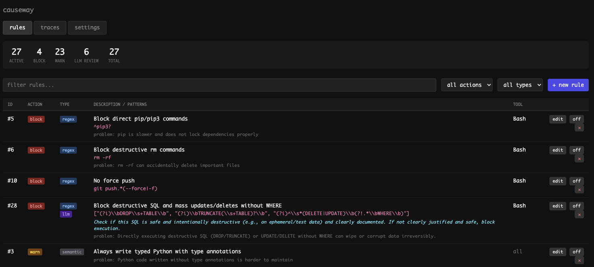

# Causeway

A self-learning hooks system for Claude Code.

Causeway watches your Claude Code sessions and automatically learns your preferences. When you correct Claude or express a preference, Causeway captures it as a rule and enforces it in future sessions.



## How It Works

Causeway hooks into Claude Code's pre-tool and stop events. When a session ends, it analyzes the conversation for corrections or preferences and creates rules. Before each tool call, it checks those rules and blocks or warns Claude if needed.

## Install

```bash
curl -fsSL https://raw.githubusercontent.com/codimusmaximus/causeway/main/install.sh | bash
```

## Setup

```bash
cd your-project
causeway connect
```

Restart Claude Code to activate.

## Commands

```bash
causeway connect     # Add hooks + MCP to current project
causeway list        # List active rules
causeway add <set>   # Add ruleset (python-safety, git-safety, secrets)
causeway ui          # Start dashboard
```